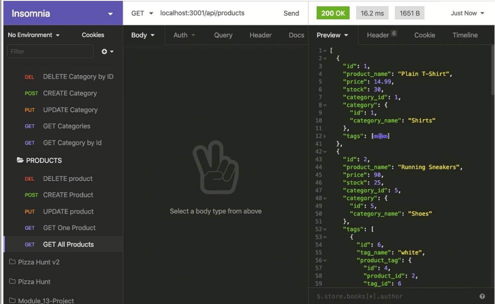

# Ecommerce Design

# Walkthrough Link
Link:

## Description

Ecommerce Design is a website built for a competitive retail business that would like to stay current in their ecommerce technologies. This application allows the user to:

* Connect to a database using Sequilize
* Sync Sequlize models to MySQL databases
* Using API GET have access to categories, products, and product tags
* Create, update, and delete data in your database 

## License

MIT CC 